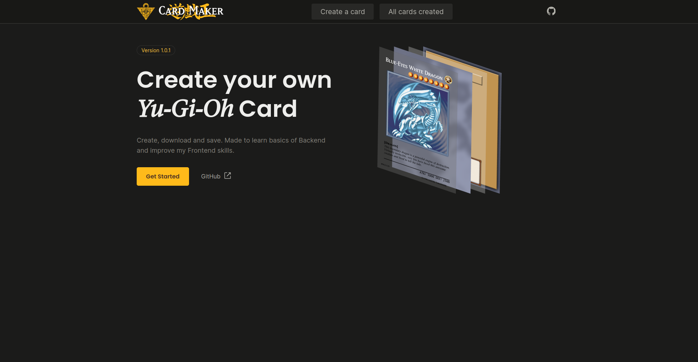
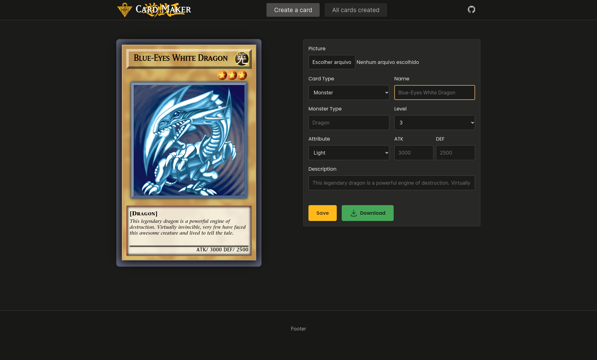

  
Conteudos

    <li>
      <a href="#sobre-o-projeto">Sobre o projeto</a>
      <ul>
        <li><a href="#feito-com">Feito com</a></li>
      </ul>
    </li>
    <li>
      <a href="#paginas">Paginas</a>
    </li>
    <li>
      <a href="#creditos">Creditos</a>
    </li>

## Sobre o projeto

  

O Yu-Gi-Oh CardMaker foi criado com o intuito de desenvolver minhas habilidades em Front End e ter meu primeiro contato com o Back End. A aplicação permite o usuário alterar dinamicamente uma carta e podendo salvar no banco de dados ou fazer o download em png.

### Feito com

- [Vite](https://vitejs.dev/) + [React](https://react.dev/)
- [Node.js](https://nodejs.org/) + [Express](https://www.npmjs.com/package/express)
- [DOM to image](https://www.npmjs.com/package/dom-to-image)
- [MongoDB Atlas](https://www.mongodb.com)

## Paginas

  
  
  

(<a href="#sobre-o-projeto">voltar ao topo</a>)

## Creditos

- [Radix Colors](https://www.radix-ui.com/colors)
- [Figma - Yu-Gi-Oh! Card Customizer by jordan](https://www.figma.com/community/file/1218914518384882637)
